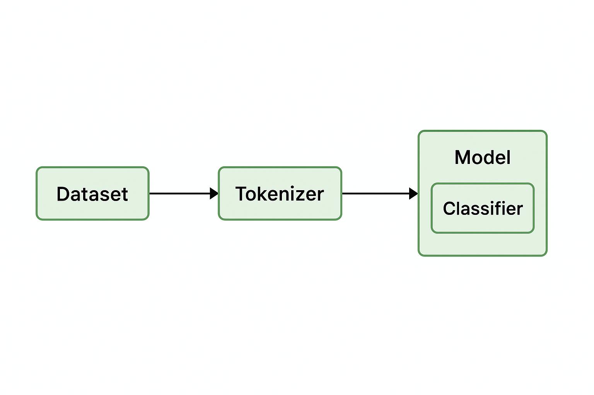

# 🧠 Resume Classifier using Hugging Face Transformers

> Classify resumes into job roles using fine-tuned BERT models.



This project is an **AI-powered resume classifier** that leverages the power of **Transformers (BERT)** and the **Hugging Face ecosystem** to automatically classify resumes into professional categories like Data Scientist, Backend Developer, DevOps Engineer, and more.

Built from scratch using modern deep learning tools and structured for production and portfolio use.

---

## 🚀 Features

- Fine-tunes `bert-base-uncased` on a labeled resume dataset
- Clean pipeline with Hugging Face `Trainer`
- Supports **10 job categories**
- Python 3.11+, Transformers 4.52+
- CLI and Colab-compatible
- Modular project structure

---

## 🧠 Architecture


---

## 🗂️ Label Mapping

```python
{
    "Backend Developer": 0,
    "Computer Vision Engineer": 1,
    "Data Analyst": 2,
    "Data Scientist": 3,
    "DevOps Engineer": 4,
    "Digital Marketer": 5,
    "Machine Learning Engineer": 6,
    "Product Manager": 7,
    "Software Engineer": 8,
    "UI/UX Designer": 9
}

resume-classifier/
├── assets/
│   ├── architecture.png
│   ├── training_chart.png
│   └── sample_inference.png
│
├── data/
│   └── synthetic_resume_dataset.csv
│
├── saved_model/
│
├── src/
│   ├── preprocess.py
│   ├── train.py
│   └── inference.py
│
├── requirements.txt
└── README.md


# 1. Create and activate environment
python -m venv venv
source venv/bin/activate  # or .\venv\Scripts\activate on Windows

# 2. Install dependencies
pip install -r requirements.txt

# 3. Train the model
python src/train.py

# 4. Run inference
python src/inference.py "I developed APIs and deployed scalable systems in AWS."
